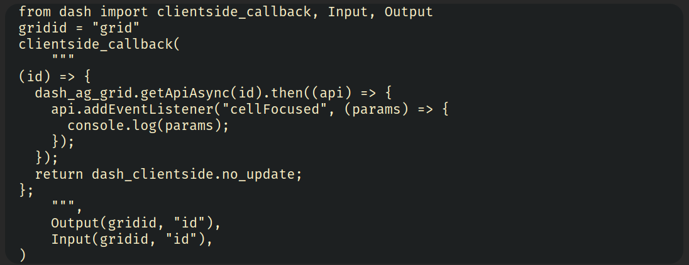
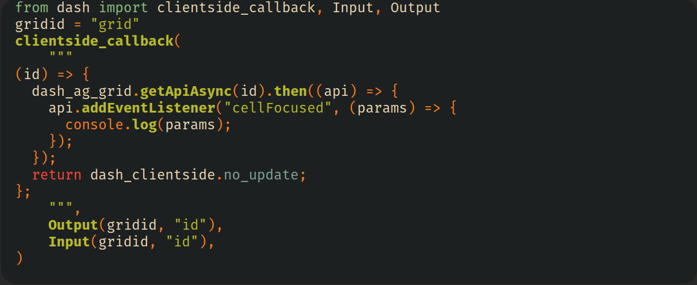

# mordant
mordant is a syntax highlighter for Github-flavored markdown files requiring *absolutely zero javascript*. It takes 
fenced code blocks, and converts them to the appropriate HTML with classes corresponding
to the tree-sitter grammar nodes of the block.

mordant is *not* a fully-featured markdown renderer. It is meant to be used in conjuction with a markdown renderer which
supports inline HTML tags.
It is named after a class of substances used to bind dyes to fabric, since it binds pretty colors
to your markdown files. 

For example,
```{markdown}
\```{javascript}
(x) => {
  // do stuff to x ...
  return x;
}
\```
```

will be converted to:

```{html}
<pre><code>
<span class="code-punctuation.bracket">(</span><span class="code-variable">x</span><span class="code-punctuation.bracket">)</span> <span class="code-operator">=></span> <span class="code-punctuation.bracket">{</span>
  <span class="code-comment">// do stuff to x ...</span>
  <span class="code-keyword">return</span> <span class="code-variable">x</span><span class="code-punctuation.delimiter">;</span>
<span class="code-punctuation.bracket">}</span>
</code></pre>
```

With a bit of css (see [styling](#styling)), we go from



to 



Note the language injection! This is a Python block, containing a string that should be treated as JavaScript,
and both languages are highlighted with editor-level quality.

This project is in pre-pre-pre alpha. I'm working on adding more configuration options and support for
more languages, and would love feedback in the form of issues, contributions and feature requests!

- [Configuration](#configuration)
  - [Supported Languages](#supported-languages)
  - [Adding New Languages](#adding-new-languages)
    - [Building into Mordant](#building-into-mordant)
    - [From Source](#from-source)
  - [Overriding Defaults for Builtin Languages](#overriding-defaults-for-builtin-languages)
- [Usage](#usage)
  - [Just Testing](#just-testing)
  - [With `ssg` (static site generator)](#with-ssg-static-site-generator)
- [Styling](#styling)
- [Roadmap](#roadmap)


## Configuration
Currently, mordant is configured through a `mordant.toml` file. By default, mordant looks for `mordant.toml` in the directory it is being run from.
You may also provide the `-c` command line flag to tell mordant to look at a specific file. For example, on my github pages site,
I require it to look at `_mordant.toml`, accomplished by running `mordant -c ./_mordant.toml --file $FILE_NAME`.

### Supported Languages
Currently, `mordant` contains support for the following languages:
- python
- javascript
- typescript (not tsx)
- lua
- json
These are gated behind features flags, so to get support for e.g., python and javascript, 
you would install mordant with `cargo install --features python,javascript --path /path/to/mordant/repo`.

### Adding New Languages
It is fairly easy to add new languages to mordant, and there are two methods to do so: as a built-in that
can be compiled with mordant, or using a tree-sitter source file.

#### Building into Mordant
Builtin languages are housed at `src/user_config/treesitter_util.rs`, in the functions `get_builtin_highlights`
and `get_builtin_language`. If your desired language already has a rust crate (which many do), you should simply add the `LANGUAGE`
and `HIGHLIGHT_QUERY` from that crate to the match statement, and gate it behind your language feature.

For example, if I wanted to add `foolang` to mordant, I would add the following cases to my match statements in
`src/user_config/treesitter_util.rs`:

```rust
pub fn get_builtin_language(name: &str) -> MordantConfigResult<Language> {
    match name {
        /* ... other languages ... */
        #[cfg(feature="foolang")]
        "foolang" => {
            return Ok(tree_sitter_foolang::LANGUAGE.into());
        }
        /* ... other languages ... */
    }
}
pub fn get_builtin_highlights(name: &str) -> MordantConfigResult<String> {
    match name {
        /* ... other languages ... */
        #[cfg(feature="foolang")]
        "foolang" => {
            return Ok(tree_sitter_foolang::HIGHLIGHTS_QUERY.into());
        }
        /* ... other languages ... */
    }
}
// optionally, add a locals query as well. Not all languages support this,
// so it is not required.
```

Then, add `foolang` as a feature to `Cargo.toml`

```toml
#...

[dependencies]
# ...
tree-sitter-foolang = {version = "*", optional = true}

[features]
# ...
foolang = ["dep:tree-sitter-foolang"]
```

*Please contribute any desired languages!*. Would love to have them onboard.

#### From Source
If you are looking to work with a proprietary language that you don't want to contribute upstream,
or need to work with a language that does not have an existing rust crate, it is also possible to include languages
directly from `.so` files.
For example, consider the `foolang` example from earlier.
To add it from source, I can add the following to my `mordant.toml`:

```toml
# nvim-treesitter-location = "..." # this is optional, and currently not working. free to ignore.
[languages.foolang]
# name is used to match @injection.language captures to the actual tree-sitter grammar.
# it is required.
name = "foolang" 
# symbol_name is optional. If not provided, default to `tree_sitter_{name}`.
language = { path = "/path/to/source/file.so", symbol_name = "tree_sitter_foo_foolang" } 
# all queries are configured with the same options. setting path will look for the query file, 
# setting query will use that text directly.
highlights_query = { path = "/path/to/queries/highlights.scm" }

# injections_query and locals_query are optional.
injections_query = { query = "(_) . @injection.content (#set! injection.language \"barbazscript\")" }

# here's an example where I use my existing nvim_treesitter installation to get highlights and a grammar
# for python. Shell expansions (e.g. tilde) should work without issue.
[languages.python]
name = "python"
language = { path = "~/.local/share/nvim/lazy/nvim-treesitter/parser/python.so", symbol_name = "tree_sitter_python" }
highlights_query = { path = "~/.local/share/nvim/lazy/nvim-treesitter/queries/python/highlights.scm" }
injections_query = { query = '''
(call
  (identifier) @name (#eq? @name clientside_callback) 
  (argument_list 
    ((string (string_content) 
	     @injection.content 
	     (#set! injection.include-children)
	     (#set! injection.language "javascript")))
	)
)
''' }
```

### Overriding Defaults for Builtin Languages
If you want to add custom injections or highlights to a builtin language, you can simply omit the `language` field.
For example, to use a custom highlights file for Javascript, without having to provide my own grammar, I could use
```toml
[languages.javascript]
name = "javascript"
highlights_query = { path = "/path/to/highlights.scm" }
```

## Usage
mordant is meant to be used in conjunction with other markdown renderers. 
The only constraint is that your desired `md->html` converter
must support inline `html` tags, so that the code blocks (which are inserted as html into your markdown docs)
are still displayed as code in the html.

### Just Testing
After cloning the repo, execute
```
$ cargo run --features=language_all -- $FILE_NAME
```
The resulting Markdown file will be printed to stdout.

Currently, mordant only supports formatting of a single file at a time. This is planned to change in the near future.

### With `ssg` (static site generator)
I originally started this project since I want to have a dirt-simple way to generate blog posts from Markdown files.
The constraint I set upon myself for [my website](https://www.connorduncan.xyz) is that it should contain exactly 0 lines of JavaScript, but still
feel somewhat modern and responsive.

My requirements are very simple: text on a screen, which HTML is very good at. To publish my [blog](https://www.connorduncan.xyz/blog) I use a
180 LoC shell script which is distributed as [ssg](https://romanzolotarev.com/ssg.html). Dirt simple.

I keep all of my posts in a folder called `_blog` (so it isn't published as part of the github pages site), and 
create the website with the following script: 

```sh
#!/bin/zsh
# create a temporary directory to hold my files, since I don't want mordant to overwrite
# my markdown files (in case I want to edit them later).
mkdir _blog_intermediate/
cp _blog/**.html ./_blog_intermediate

# run mordant on each markdown file, overwriting the output.
for file in ./_blog/**.md; do
  mordant $file -c ./_mordant.toml > ./_blog_intermediate/$(basename $file)
done

# run ssg on the files which now have inline html instead of markdown code blocks,
# moving the output into blog/
ssg _blog_intermediate/ blog/ "Connor Duncan\'s Blog" 'https://www.connorduncan.xyz/blog/'

# clean up the intermediate files.
rm -rf _blog_intermediate/
```

## Styling
mordant uses the tree-sitter highlight captures from neovim to determine highlights. This list was chosen because neovim
has (to my knowledge) the most extensive library of highlight queries of any project using treesitter, since 
treesitter is the default highlight provider for the editor.

A full list of highlight names can be found at `src/config/treesitter_util.rs`. Depending on the language
or highlight query you are using, not all of these captures will be relevant.

As a starting point, you can look at [example.css](https:://github.com/ctdunc/mordant/example.css) for a port
of the [gruvbox.nvim](https://github.com/ellisonleao/gruvbox.nvim/tree/main) theme for neovim. It supports both 
dark and light mode, and contains colors for every currently supported node.

## Roadmap
- Config
    - [x] Config file (+ hierarchy).
    - [x] Import grammars, queries.
- Hygiene
    - [x] Don't just put everything in `main`.
    - [x] Tests
- Performance
    - [ ] Multi-Threading?
    - [ ] Cached Languages?
- Docs
    - [x] Usage examples with other markdown renderers (see [this example](https://github.com/ctdunc/ctdunc.github.io/blob/master/_publish_blog.sh)).
    - [ ] CONTRIBUTING.
    - [ ] CSS examples.

