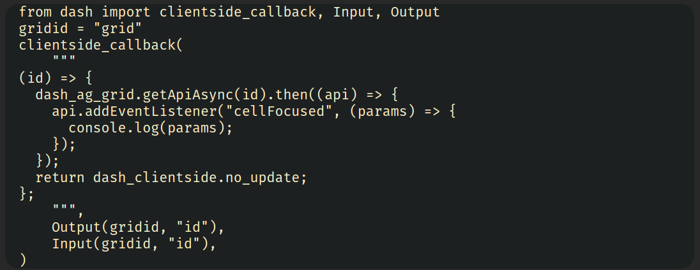
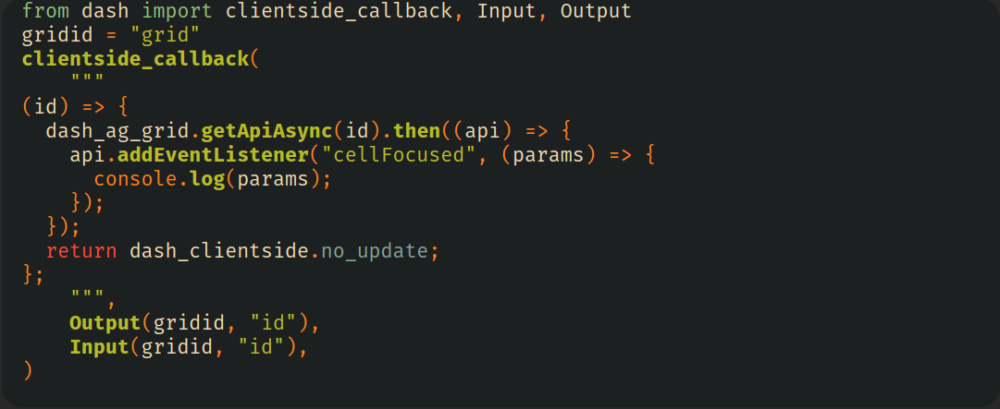

# mordant
_Text Editor quality syntax highlighting, using pure HTML and CSS._

This project is in pre-pre-pre alpha. I'm working on adding more configuration options and support for
more languages, and would love feedback in the form of issues, contributions and feature requests!

- [What is mordant?](#what-is-mordant)
- [Why should I pick mordant over highlight.js or any other library?](#why-should-i-pick-mordant-over-highlightjs-or-any-other-library)
- [Why is it called mordant?](#why-is-it-called-mordant)
- [How does mordant work?](#how-does-mordant-work)
- [What *isn't* mordant?](#what-isnt-mordant)
- [How Do I Use mordant?](#how-do-i-use-mordant)
- [Configuration](#configuration)
  - [Supported Languages](#supported-languages)
  - [Adding New Languages](#adding-new-languages)
    - [Building into Mordant](#building-into-mordant)
    - [From Source](#from-source)
  - [Overriding Defaults for Builtin Languages](#overriding-defaults-for-builtin-languages)
- [Usage](#usage)
  - [Just Testing](#just-testing)
  - [With `lowdown`.](#with-lowdown)
- [Styling](#styling)
- [Roadmap](#roadmap)


## What is mordant?

mordant is a preprocessor for Markdown files that uses [Tree-sitter](https://tree-sitter.github.io/tree-sitter/) to provide
high-quality, extensible and customizable syntax highlighting for fenced code blocks, *without the use of JavaScript*.
Put another way, it is a wrapper around [tree-sitter-highlight](https://github.com/tree-sitter/tree-sitter/tree/master/crates/highlight) which 
gives the user a straightforward way to configure language injections and highlights for cases where the standard syntax highlighting
does not cut it.

## Why should I pick mordant over highlight.js or any other library?

Any of the following are good reasons:

- you want to run a completely static site using only HTML and CSS. mordant runs entirely at the time you convert from markdown to HTML.
- you need extremely granular control over syntax highlighting.
- you are writing about a niche/proprietary language which lacks support in other renderers ([writing grammars](https://tree-sitter.github.io/tree-sitter/creating-parsers/3-writing-the-grammar.html) with Tree-sitter is actually pretty painless).
- you want **language injections**.

Language Injections are the killer feature that most major blogging platforms lack. 
For example, I write a lot about Plotly's [Dash](https://plotly.com/examples/) framework, which
requires developers to pass JavaScript as a string to the python function `clientside_callback`.
It's very nice to have syntax highlighting for both languages in this case:

Without mordant, I am stuck with:


However, with Mordant, I can support nested programming languages within a markdown document:


These injections are **controlled by the user** and highly customizable.

## Why is it called mordant?

In normal English, a mordant is a chemical compound used to bind dyes to fabric. 
In this repository, mordant is a program that binds nice colors to your markdown files.

## How does mordant work?

mordant works by converting fenced code blocks into inline HTML, wrapping syntactic elements of your code in `<span>` tags
with class names that can be manipulated using CSS.
Highlights are specified by Tree-sitter highlight queries, which should use the same [highlight groups](https://neovim.io/doc/user/treesitter.html#treesitter-highlight-groups) as nvim-treesitter.

For example,

``````{javascript}
(x) => {
  // do stuff to x ...
  return x;
}
``````

will be converted to:

```{html}
<pre><code>
<span class="code-punctuation.bracket">(</span><span class="code-variable">x</span><span class="code-punctuation.bracket">)</span> <span class="code-operator">=></span> <span class="code-punctuation.bracket">{</span>
  <span class="code-comment">// do stuff to x ...</span>
  <span class="code-keyword">return</span> <span class="code-variable">x</span><span class="code-punctuation.delimiter">;</span>
<span class="code-punctuation.bracket">}</span>
</code></pre>
```


## What *isn't* mordant?
mordant is *not* a fully-featured markdown renderer. It is meant to be used in conjuction with a markdown renderer which
supports inline HTML tags.


## How Do I Use mordant?

### Configuration

Currently, mordant is configured through a `mordant.toml` file. By default, mordant looks for `mordant.toml` in the directory it is being run from.
You may also provide the `-c` command line flag to tell mordant to look at a specific file. For example, on my github pages site,
I require it to look at `_mordant.toml`, accomplished by running `mordant -c ./_mordant.toml --file $FILE_NAME`.

#### Supported Languages
Currently, `mordant` contains support for the following languages:
- python
- javascript
- typescript (not tsx)
- lua
- json
- css
- html
- sql
- rust

These are gated behind features flags, so to get support for e.g., python and javascript, 
you would install mordant with `cargo install --features python,javascript --path /path/to/mordant/repo`.

#### Adding New Languages
It is fairly easy to add new languages to mordant, and there are two methods to do so: as a built-in that
can be compiled with mordant, or using a tree-sitter source file.

##### Building into Mordant
Builtin languages are housed at `src/user_config/treesitter_util.rs`, in the functions `get_builtin_highlights`
and `get_builtin_language`. If your desired language already has a rust crate (which many do), you should simply add the `LANGUAGE`
and `HIGHLIGHT_QUERY` from that crate to the match statement, and gate it behind your language feature.

For example, if I wanted to add `foolang` to mordant, I would add the following cases to my match statements in
`src/user_config/treesitter_util.rs`:

```rust
pub fn get_builtin_language(name: &str) -> MordantConfigResult<Language> {
    match name {
        /* ... other languages ... */
        #[cfg(feature="foolang")]
        "foolang" => {
            return Ok(tree_sitter_foolang::LANGUAGE.into());
        }
        /* ... other languages ... */
    }
}
pub fn get_builtin_highlights(name: &str) -> MordantConfigResult<String> {
    match name {
        /* ... other languages ... */
        #[cfg(feature="foolang")]
        "foolang" => {
            return Ok(tree_sitter_foolang::HIGHLIGHTS_QUERY.into());
        }
        /* ... other languages ... */
    }
}
// optionally, add a locals query as well. Not all languages support this,
// so it is not required.
```

Then, add `foolang` as a feature to `Cargo.toml`

```toml
#...

[dependencies]
# ...
tree-sitter-foolang = {version = "*", optional = true}

[features]
# ...
foolang = ["dep:tree-sitter-foolang"]
```

*Please contribute any desired languages!*. Would love to have them onboard.

##### From Source
If you are looking to work with a proprietary language that you don't want to contribute upstream,
or need to work with a language that does not have an existing rust crate, it is also possible to include languages
directly from `.so` files.
For example, consider the `foolang` example from earlier.
To add it from source, I can add the following to my `mordant.toml`:

```toml
# nvim-treesitter-location = "..." # this is optional, and currently not working. free to ignore.
[languages.foolang]
# name is used to match @injection.language captures to the actual tree-sitter grammar.
# it is required.
name = "foolang" 
# symbol_name is optional. If not provided, default to `tree_sitter_{name}`.
language = { path = "/path/to/source/file.so", symbol_name = "tree_sitter_foo_foolang" } 
# all queries are configured with the same options. setting path will look for the query file, 
# setting query will use that text directly.
highlights_query = { path = "/path/to/queries/highlights.scm" }

# injections_query and locals_query are optional.
injections_query = { query = "(_) . @injection.content (#set! injection.language \"barbazscript\")" }

# here's an example where I use my existing nvim_treesitter installation to get highlights and a grammar
# for python. Shell expansions (e.g. tilde) should work without issue.
[languages.python]
name = "python"
language = { path = "~/.local/share/nvim/lazy/nvim-treesitter/parser/python.so", symbol_name = "tree_sitter_python" }
highlights_query = { path = "~/.local/share/nvim/lazy/nvim-treesitter/queries/python/highlights.scm" }
injections_query = { query = '''
(call
  (identifier) @name (#eq? @name clientside_callback) 
  (argument_list 
    ((string (string_content) 
	     @injection.content 
	     (#set! injection.include-children)
	     (#set! injection.language "javascript")))
	)
)
''' }
```

#### Overriding Defaults for Builtin Languages
If you want to add custom injections or highlights to a builtin language, you can simply omit the `language` field.
For example, to use a custom highlights file for Javascript, without having to provide my own grammar, I could use
```toml
[languages.javascript]
name = "javascript"
highlights_query = { path = "/path/to/highlights.scm" }
```

### Usage
mordant is meant to be used in conjunction with other markdown renderers. 
The only constraint is that your desired `md->html` converter
must support inline `html` tags, so that the code blocks (which are inserted as html into your markdown docs)
are still displayed as code in the html.

#### Just Testing
After cloning the repo, execute
```
$ cargo run --features=language_all -- $FILE_NAMES
```
the resulting markdown will be written to `./mordant.out`, with mirrored directory structure.


#### With `lowdown`.
I originally started this project since I want to have a dirt-simple way to generate blog posts from Markdown files.
The constraint I set upon myself for [my website](https://www.connorduncan.xyz) is that it should contain exactly 0 lines of JavaScript, but still
feel somewhat modern and responsive.

I keep all of my markdown files in `./site`, and want everything to build into `./_site`, which is
deployed by the GH pages pipeline. You can check out the full thing [here](https://github.com/ctdunc/ctdunc.github.io).
Look in `build.sh`.
```sh
rm -f -rf -- ./_site/
mkdir ./_site

cd site
mordant -c ../mordant.toml --output-dir ../_tmp_mordant ./**/*.md ./*.md
cd ..

for file in $(find ./_tmp_mordant -name *.md); do
	base_name=$(basename $file .md)
        # I need to remove the _tmp_mordant slop from my paths. But I don't want
        # the program to write in place either.
	site_path=$(dirname $file | sed 's/\.\/_tmp_mordant//')
	mkdir -p "./_site/$site_path"
	lowdown --template=./template.html \
	  -s "./_tmp_mordant/$site_path/$base_name.md" \
	  -thtml \
	  --html-no-skiphtml \
	  --html-no-escapehtml > "./_site/$site_path/$base_name.html"
done
```

### Styling
mordant attempts to match the capture names from the [nvim-treesitter](https://github.com/nvim-treesitter/nvim-treesitter/blob/master/CONTRIBUTING.md#highlights)
project. 
nvim-treesitter has (to my knowledge) the most extensive library of highlight queries of any project using treesitter.

A full list of highlight names can be found at `src/config/treesitter_util.rs`. Depending on the language
or highlight query you are using, not all of these captures will be relevant.

As a starting point, you can look at [example.css](https:://github.com/ctdunc/mordant/example.css) for a port
of the [gruvbox.nvim](https://github.com/ellisonleao/gruvbox.nvim/tree/main) theme for neovim. It supports both 
dark and light mode, and contains colors for every currently supported node.

## Roadmap
- Config
    - [x] Config file (+ hierarchy).
    - [x] Import grammars, queries.
- Hygiene
    - [x] Don't just put everything in `main`.
    - [x] Tests
- Performance
    - [x] Multi-Threading? (Rayon)
    - [ ] Cached Languages?
- Docs
    - [x] Usage examples with other markdown renderers (see [this example](https://github.com/ctdunc/ctdunc.github.io/blob/master/_publish_blog.sh)).
    - [ ] CONTRIBUTING.
    - [ ] CSS examples.

